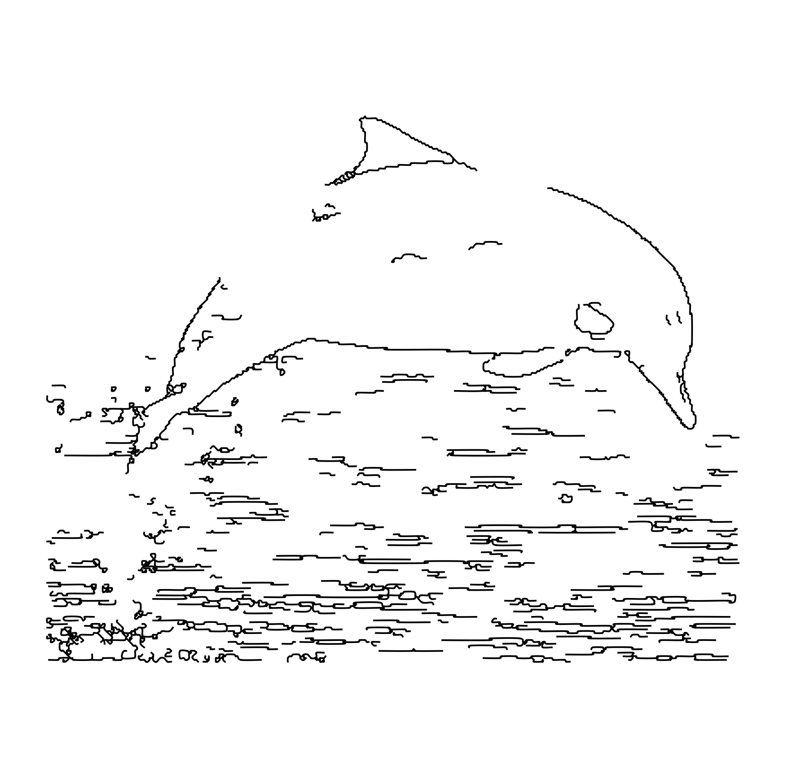
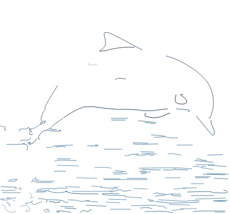
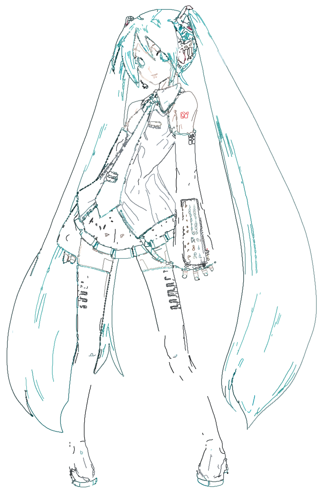
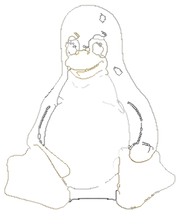
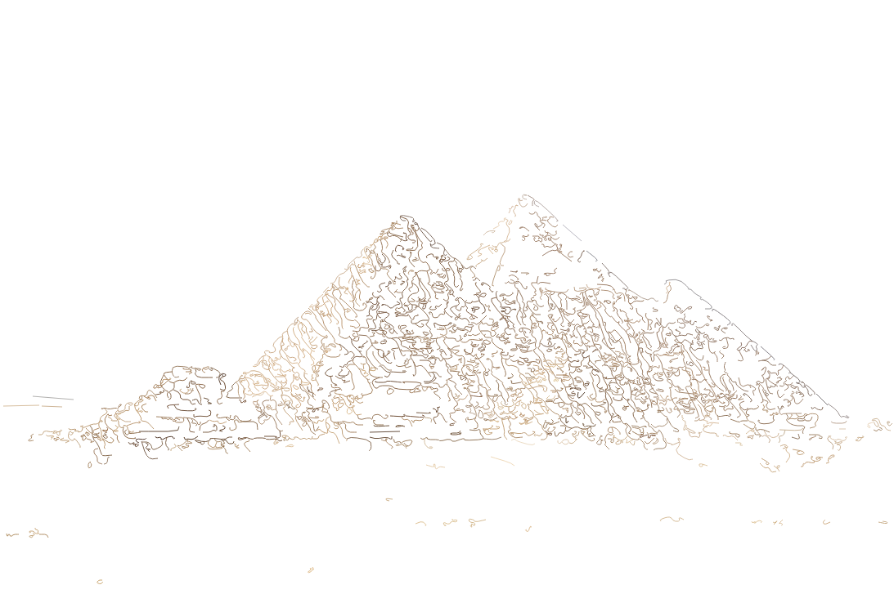

# Vectomancy

[English](README.md) | [简体中文](README.zh-CN.md) | [繁體中文](README.zh-TW.md) | [日本語](README.ja.md) | [Français](README.fr.md) | [Español](README.es.md)

Vectomancy 是一个高性能的命令行图像转换工具。它能深入解析光栅图像和矢量文件，将它们转化为极具数学美感的参数方程集合，并且直接渲染为各大数学软件支持的工程格式或脚本。

## 实例展示

| 原始图像                                      | 渲染输出 (无颜色)                                     | 渲染输出 (彩色)                                             |
| :-------------------------------------------- | :---------------------------------------------------- | :---------------------------------------------------------- |
|          |          |          |
|  |  |  |
|              |              |              |
|  |  |  |

### 图像来源

- Dolphin: [https://en.wikipedia.org/wiki/Guiana_dolphin#/media/File:Descri%C3%A7%C3%A3o_in%C3%ADcio_ou_comportamento.jpg](https://en.wikipedia.org/wiki/Guiana_dolphin#/media/File:Descri%C3%A7%C3%A3o_in%C3%ADcio_ou_comportamento.jpg)
- Miku: [https://storage.moegirl.org.cn/moegirl/commons/3/35/Hatsune_miku_v2.png](https://storage.moegirl.org.cn/moegirl/commons/3/35/Hatsune_miku_v2.png)
- Tux: [https://en.wikipedia.org/wiki/File:Tux.svg](https://en.wikipedia.org/wiki/File:Tux.svg)
- Pyramid: [https://en.wikipedia.org/wiki/Pyramid#/media/File:01_khafre_north.jpg](https://en.wikipedia.org/wiki/Pyramid#/media/File:01_khafre_north.jpg)

## 核心功能

- **多格式数学公式导出**：支持 Python (Matplotlib), LaTeX (TikZ), Wolfram, GeoGebra (`.ggb`), Kmplot (`.fkt`), HTML5 Canvas, 以及原生 JSON。
- **AST 体积优化**：使用 `Zlib + Base64` 编码来存储巨大的浮点数矩阵，不仅使生成文件小巧，更避免了编辑器和渲染引擎在打开文件时发生的解析树(AST)卡死崩溃问题。
- **可控的光滑度与渲染模式**：
  - `--mode spline`：以精确的贝塞尔曲线插值还原形状，搭配 Chaikin 算法平滑处理，解决阶梯锯齿感。
  - `--mode fourier`：利用傅里叶级数（基于 TSP 旅行商路径规划），逼近生成一条连续的一笔画图像曲线。

关于底层的具体数学算法细节（例如 Otsu 二值化、Ramer-Douglas-Peucker 降维、Moore 邻域追踪和 FFT 傅里叶变换），请参阅更详细的 [用户使用手册](docs/user_manual.md)。

## 安装方式

从源码编译需要预先安装 Rust 工具链：

```bash
git clone https://github.com/Xuepoo/vectomancy.git
cd vectomancy/vectomancy
cargo build --release
```

通过容器运行 (Docker/Podman)：

```bash
# 本地构建容器镜像
docker build -t vectomancy .
# 挂载当前目录并运行
docker run --rm -v $(pwd):/data vectomancy run --output /data/output.json /data/input.svg
```

你也可以在 [GitHub Releases](https://github.com/Xuepoo/vectomancy/releases) 页面下载对应于 Linux (Debian, Arch, RedHat, openSUSE, NixOS 等), Windows, macOS 平台的预编译原生二进制文件。

## CLI 基础用法

```bash
vectomancy run [OPTIONS] --output <OUTPUT> <INPUT>
```

常用选项:

- `-o, --output <OUTPUT>`: 导出生成文件的路径。
- `-f, --format <FORMAT>`: 输出文件格式 (python, latex, html, json, geogebra, wolfram, kmplot)。
- `-m, --mode <MODE>`: 计算模式 (fourier, spline)。
- `-n, --terms <TERMS>`: 傅里叶级数逼近项数 (默认: 1000)。

系统配置默认从 `~/.config/vectomancy/config.toml` 中加载，遵循 XDG 规范。

## 常见问题排查 (FAQ)

**Q: 打开生成的 Python 或 HTML 文件，我的 VSCode 会卡死吗？**
**A:** 不会。我们在生成的脚本开头自动注入了防扫描指令（如 `# pylint: disable=all` 或 `<!-- eslint-disable -->`）。且通过 Zlib 压缩，文件体积极小，主流 IDE 都可以安全打开。

**Q: 为什么我导入 GeoGebra 会卡死？**
**A:** 纯数学公式渲染软件受限于内部 XML 树解析限制，如果图片包含过多噪点导致方程多达上万条就会卡顿。建议通过增加 `--tolerance`（比如设定为 2.0 或 3.0）并指定 `--min-path-len` 以滤除细碎线条。详情请参考 [用户使用手册](docs/user_manual.md) 了解相关调优说明。

## 许可证

本项目采用 MIT 许可证。
