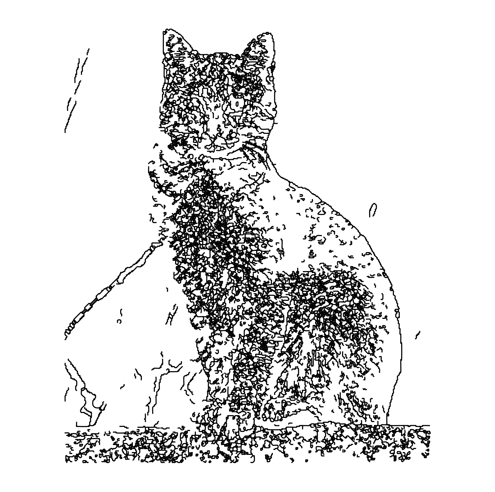
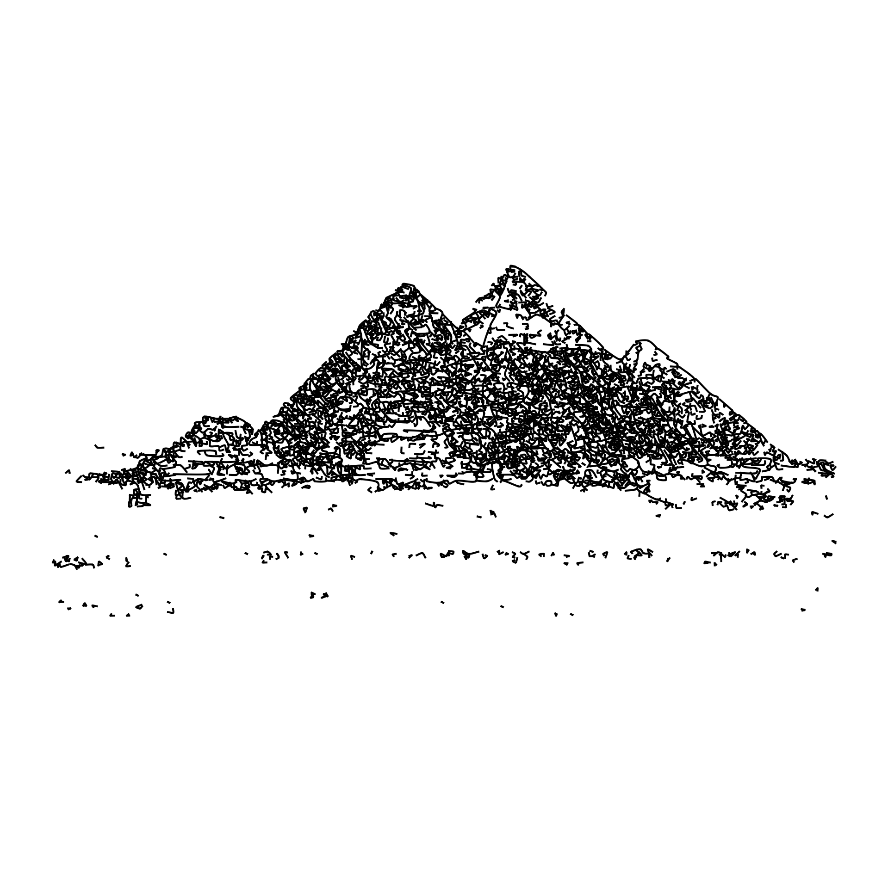

# Vectomancy (矢量魔法)

Vectomancy 是一个高性能命令行工具，旨在解析各种图形文件，并将它们转换为数学参数方程和渲染脚本。它允许用户将栅格图像和矢量图形转换为数学波形。

## 功能特性

- **输入解析与预处理：**
  - **矢量 (`.svg`)：** 将路径、变换和基本形状解析为归一化的绝对坐标。
  - **栅格 (`.png`, `.jpg`, `.webp`)：** 使用 Ramer-Douglas-Peucker (RDP) 算法进行降噪、二值化、轮廓跟踪、骨架化和点云简化。
- **数学转换引擎：**
  - **傅里叶级数近似 (`--mode fourier`)：** 使用 TSP (最近邻 + 2-Opt) 寻找最优连续路径，然后应用 FFT 以可配置的项数 (`--terms`) 近似路径。适用于栅格输入或复杂的非参数形状。
  - **精确参数样条 (`--mode spline`)：** 将 SVG 贝塞尔曲线转换为精确的参数多项式方程组。
- **模板驱动输出：** 生成多种格式的输出：LaTeX (`.tex`)、Desmos HTML (`.html`)、Python Matplotlib (`.py`)、GeoGebra 命令 (`.ggb.txt`) 和原始 JSON (`.json`)。

## 核心算法

该引擎采用多种技术来实现精确转换：

- **Otsu 二值化**：自动确定图像二值化的最佳阈值。
- **Moore 邻域跟踪**：从二值图像中提取轮廓。
- **Ramer-Douglas-Peucker 简化**：通过减少点数来简化路径，同时保留形状。
- **TSP 最近邻 + 2-Opt**：优化傅里叶级数近似的路径连续性。
- **FFT (快速傅里叶变换)**：使用可配置的项数近似路径。

## 示例展示

| 原始图像                                     | 渲染输出                                            |
| :------------------------------------------- | :-------------------------------------------------- |
|       |       |
|                   |                   |
|  |  |
|       |       |

### 图像来源

- Miku: [https://storage.moegirl.org.cn/moegirl/commons/3/35/Hatsune_miku_v2.png](https://storage.moegirl.org.cn/moegirl/commons/3/35/Hatsune_miku_v2.png)
- Tux: [https://en.wikipedia.org/wiki/File:Tux.svg](https://en.wikipedia.org/wiki/File:Tux.svg)
- Cat: [https://en.wikipedia.org/wiki/Tabby_cat#/media/File:Cat_November_2010-1a.jpg](https://en.wikipedia.org/wiki/Tabby_cat#/media/File:Cat_November_2010-1a.jpg)
- Pyramid: [https://en.wikipedia.org/wiki/Pyramid#/media/File:01_khafre_north.jpg](https://en.wikipedia.org/wiki/Pyramid#/media/File:01_khafre_north.jpg)

## CLI 使用方法

```bash
vectomancy run [OPTIONS] --output <OUTPUT> <INPUT>
```

选项：

- `-o, --output <OUTPUT>`：生成输出文件的路径。
- `-f, --format <FORMAT>`：输出格式 (python, latex, html, json, geogebra, wolfram)。
- `-m, --mode <MODE>`：转换模式 (fourier, spline)。
- `-n, --terms <TERMS>`：傅里叶近似的项数 (默认: 1000)。

配置从 `~/.config/vectomancy/config.toml` 加载，遵循 XDG 基础目录规范。

## 路线图

- 通过计算着色器 (wgpu 和 Vulkan) 实现 GPU 加速。
- 多线程改进。
- 彩色终端输出。

## 许可证

本项目采用 MIT 许可证。

## 安装

你需要安装 Rust 工具链。

```bash
cargo build --release
```
